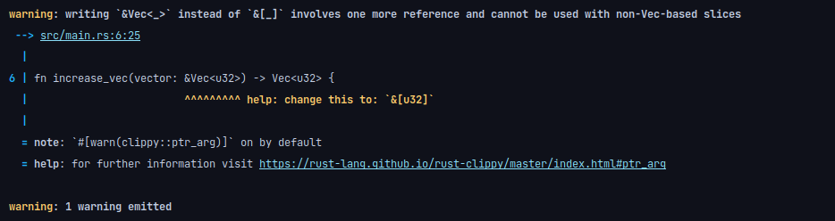
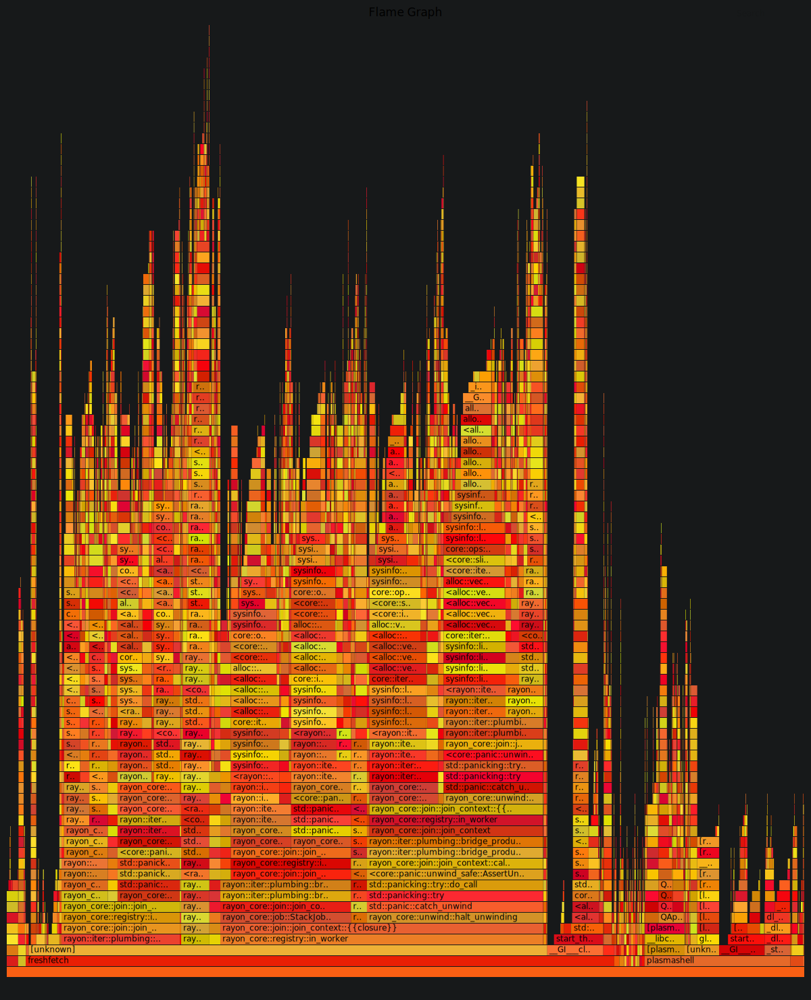
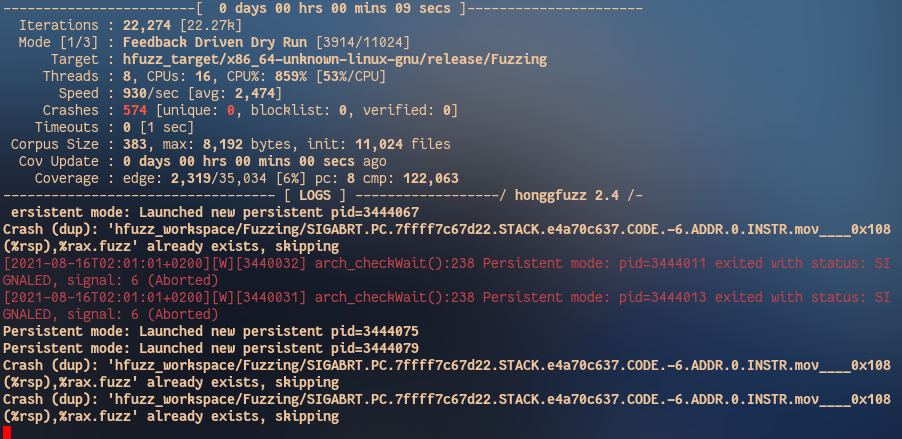

+++
title = "Cargo Plugins"
date = "2021-08-12T21:31:55+02:00"
author = ""
authorTwitter = "" #do not include @
cover = ""
tags = ["rust", "cargo"]
keywords = ["rust", "cargo"]
description = "My favorite 5 cargo plugins"
showFullContent = false
+++

Here are the 5 cargo plugins I use the most(Keep in mind these depend on the use case):

## 1. [clippy](https://github.com/rust-lang/rust-clippy)

Clippy is by far the most useful linter, although it gives some false positives it is generally very useful for common
mistakes that can be found in Rust code.

For example in this code:

```rust
fn main() {
    let vec = vec![1, 2, 3, 4];
    increase_vec(&vec);
}

fn increase_vec(vector: &Vec<u32>) -> Vec<u32> {
    vector.iter().map(|v| v + 1).collect()
}
```

The default compiler gives no warnings at all. However, using `cargo clippy` in the projects' directory gives us the
following tip:
[](https://rust-lang.github.io/rust-clippy/master/index.html#ptr_arg)

So we can replace the vector with a reference to an array which is faster since it uses one reference less.

Installing Clippy is very easy:

```bash
rustup update
rustup component add clippy
```

And we can run it using: `cargo clippy`

## 2. [cargo-checkmate](https://github.com/nathan-at-least/cargo-checkmate)

This plugin bundles a bunch of other plugins together.
It first performs a `cargo check`, compares the current formatting with the one of `cargo fmt`, checks if
`cargo build` passes, checks if tests pass, then checks if the docs compile and lastly runs `cargo audit` to check for
vulnerabilities in dependencies.

An output will probably look something like this:
[](https://github.com/nathan-at-least/cargo-checkmate)

You can install it via:
`cargo install cargo-checkmate`

And to use it run:
`cargo checkmate`

And to execute it on every commit execute:
`cargo checkmate git-hook install`
in the project folder.

## 3. [cargo flamegraph](https://lib.rs/crates/flamegraph)

Cargo flamegraph generates a so-called "flamegraph" of your program. It generates a graph which shows where execution
time is being spent in your program. This way it can help you figure out what to optimize in order to get better
performance out of your program.

By default, flamegraph will use the release output which is fine for most cases, however in order to get more
information we can add

```toml
[profile.release]
debug = true
```

to our Cargo.toml.

To use it properly on Linux we either have to run it as root or lower `perf_event_paranoid`(Which may not fit your security
needs):

```bash
sudo echo -1 | sudo tee /proc/sys/kernel/perf_event_paranoid
```

This is what a graph looks like, from the example of [freshfetch](https://github.com/K4rakara/freshfetch):
[](https://github.com/K4rakara/freshfetch)

## 4. [honggfuzz-rs](https://github.com/rust-fuzz/honggfuzz-rs)

Fuzzing has become very important in software security and stability nowadays. This fuzzer, developed by Google, is
probably one of the best available.

We install it by using:

```bash
cargo install honggfuzz
```

Add it to project dependencies using:

```toml
[dependencies]
honggfuzz = "0.5"
```

Create a target to fuzz:

```rust
extern crate url;
use honggfuzz::fuzz;

fn main(){
    println("Starting fuzzer...");
    loop{
        fuzz!(|data: &[u8]| {
            if let Ok(s) = std::str::from_utf8(data) {
                let _ = url::Url::parse(s);
            }
        }
    }
}
```

Now if we run:

```bash
cargo hfuzz run TARGET # TARGET is typically the crate name, but it depends
```

We see a terminal like this:
[](https://honggfuzz.dev/)

While it's running we see a hfuzz_workspace directory, which has TARGET directory, where we can find
the found unique crashes, along with a honggfuzz report, which contains details on how it crashed.

## 5. [cargo-update](https://github.com/nabijaczleweli/cargo-update)

This Plugin is used to update all the binaries we just installed.

Install it by using:

```bash
cargo install cargo-update
```

And update binaries using:

```bash
cargo install-update -a
```

It would probably also make sense to make it a Pacman hook(or something similar on other Linux distros).

[Here is mine](https://gist.github.com/Nereuxofficial/3375a8c02a2e13a51ff24206f8fd6f46), though you need to replace the
[USER] with your username.

## Conclusion

There are obviously many Plugins I haven't mentioned that are very useful too, for example
[cargo-criterion](https://github.com/bheisler/cargo-criterion), which is useful for benchmarks or
[cargo-outdated](https://github.com/kbknapp/cargo-outdated), which helps you keep your dependencies up to date.

But I hope at least some of them were useful to you and made your workflow a bit easier.
