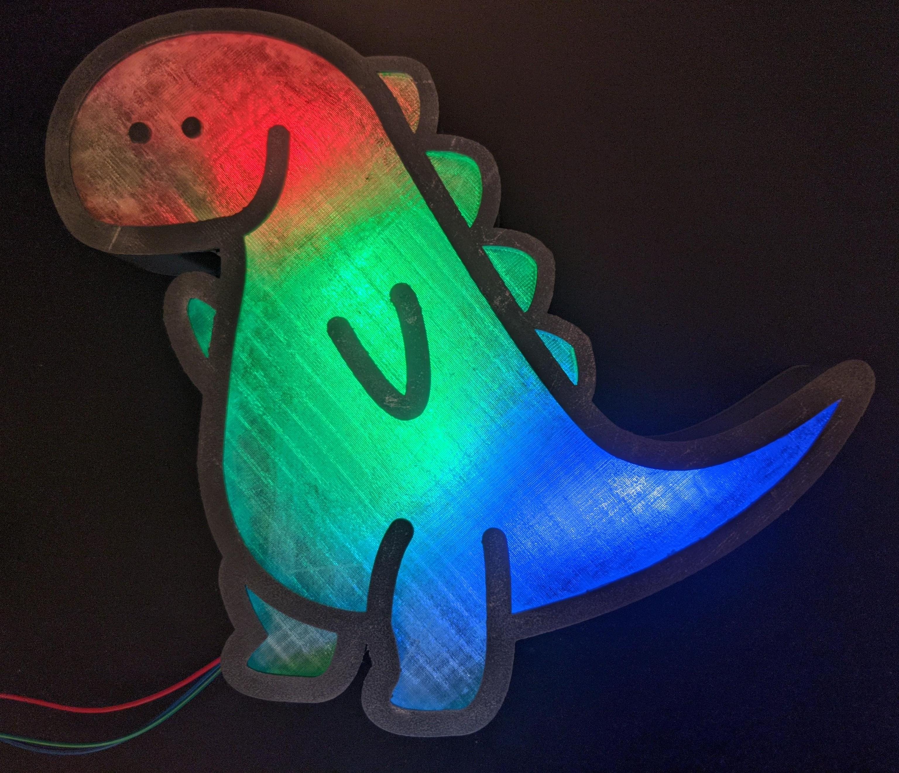

+++
title = "Making a Dino Light with the ESP32 and WS2812"
date = "2022-03-05T21:31:55+02:00"
author = ""
authorTwitter = "" #do not include @
cover = ""
tags = ["rust", "embedded", "esp32", "ws2812"]
keywords = ["rust", "embedded", "esp32", "ws2812"]
description = "Found a cute thing on Thingiverse and decided to make it with another chip and in Rust"
showFullContent = false
+++

I found [this](https://www.thingiverse.com/thing:5220507/) on thingiverse and 
decided to make it, but with Rust and an ESP32.


This is the final result:



## Hardware Part
I'd recommend getting WS2812 strips with less than 144 Pixels/m since it's really
painful to solder with that density, especially when you have little experience with
soldering like me. For the ESP32 I'd recommend the ESP32-C, since that chip has a 
RISC-V chip, which has better Rust support than the Xtensa based boards.

If your microcontroller has a 5V connector we're going to connect that to the 5V input of 
the LED strip, otherwise you'll need another way to supply the 5V. Also, just connect the GND
Pin to the GND Pin of the LEDs. As a data Pin, take a look at the Pin-out diagram of your board. 
In my case the GPIO15 should do nicely, since it's not used for internal flashing and works nicely
with SPI.

## Software Part
THIS ENTIRE SECTION IS NOT NECESSARY ANMORE. You can now use [espup](https://github.com/esp-rs/espup), which sets up everything needed.

### Setting up the toolchain and compiler
This has been really painful for me to set up, and I hope you can avoid some frustration
by following this post.

You can avoid nearly all of this setup by getting the ESP32-C as mentioned above.

Download rust-build using this command:

`git clone https://github.com/esp-rs/rust-build`

Install it via this command:

`cd rust-build; ./install-rust-toolchain.sh`

After the script is finished, follow the instructions at the end.

Now use `rustup default esp`(except if you have the C in which case you can use Rust nightly) and
install `cargo install cargo-espflash`, used for flashing, and cargo pio(which decodes the stack trace): 
```bash
curl -fsSL https://raw.githubusercontent.com/platformio/platformio-core-installer/master/get-platformio.py -o get-platformio.py
python3 get-platformio.py
cargo install cargo-pio
```

Compile and flash via(on Windows you will have to look up the command yourself):

```bash
cargo espflash --release /dev/ttyUSB0
```

If flashing with cargo espflash doesn't work you can try pressing the `Boot` Button during
the command, which always worked for me.

We can monitor the serial output via:
```bash
cargo pio espidf monitor /dev/ttyUSB0
```

## Code

For the dependencies we have this in our `Cargo.toml`:
```toml
[dependencies]
# For the ESP32
esp32 = "0.11.0"
esp32-hal = "0.3.0"
xtensa-lx = { version = "0.4.0", features = ["lx6"] }
xtensa-lx-rt = { version = "0.7.0", optional = true, features = ["lx6"] }
# For the LEDs
ws2812-spi = "0.4.0"
smart-leds = "0.3.0"
```

At the start of our `main.rs` file we need these since we're working with 
a microcontroller and don't have the std library for it([There is a project for the ESP32 with the std library](https://github.com/ivmarkov/rust-esp32-std-demo)).
```rust
#![no_std]
#![no_main]
```

Now the main function:
```rust
#[entry]
fn main() -> ! {
    loop{
        
    }
}
```

We need the #[entry] attribute to define the entry point of the program and the "!" signals
that the function will not return and this is also why we need the never ending loop.

Then the actual setup:
```rust
#[entry]
fn main() -> ! {
    let dp = target::Peripherals::take().unwrap();
    let (_, dport_clock_control) = dp.DPORT.split();

    let clkcntrl = ClockControl::new(
        dp.RTCCNTL,
        dp.APB_CTRL,
        dport_clock_control,
        XTAL_FREQUENCY_AUTO,
    )
    .unwrap();
    let (clkcntrl_config, _) = clkcntrl.freeze().unwrap();
    let pins = dp.GPIO.split();
    let data_out = pins.gpio15.into_push_pull_output();
    // We need SPI for the WS2812 library
    let spi: SPI<_, _, _, _> = SPI::<esp32::SPI2, _, _, _, _>::new(
        dp.SPI2,
        spi::Pins {
            sclk: pins.gpio14,
            sdo: data_out,
            sdi: Some(pins.gpio25),
            cs: None,
        },
        spi::config::Config {
            baudrate: 3.MHz().into(),
            bit_order: spi::config::BitOrder::MSBFirst,
            data_mode: spi::config::MODE_0,
        },
        clkcntrl_config,
    )
    .unwrap();
    let ws = Ws2812::new(spi);
    loop{
    }
}
```

Now we create some structs to control the Strip easier:
```rust
const NUM_LEDS: usize = 23;

struct LightData {
    leds: [RGB8; NUM_LEDS],
}
struct Strip {
    ws: Ws2812<SPI<SPI2, Gpio14<Unknown>, Gpio15<Output<PushPull>>, Gpio25<Unknown>>>,
    data: LightData,
    brightness: u8,
}
```

And some functions to manipulate the data inside:
```rust
impl LightData {
    fn empty() -> Self {
        Self {
            leds: [RGB8::new(0, 0, 0); NUM_LEDS],
        }
    }
    fn write_to_strip(
        &self,
        strip: &mut Ws2812<SPI<SPI2, Gpio14<Unknown>, Gpio15<Output<PushPull>>, Gpio25<Unknown>>>,
    ) {
        strip.write(self.leds.iter().cloned()).unwrap();
    }
    
    fn get_led(&self, index: usize) -> RGB8 {
        self.leds[index]
    }
    fn set_color_all(&mut self, color: RGB8) {
        for i in 0..NUM_LEDS {
            self.set_color(i, color);
        }
    }
    fn set_red(&mut self, index: usize, red: u8) {
        self.leds[index].r = red;
    }
    fn set_green(&mut self, index: usize, green: u8) {
        self.leds[index].g = green;
    }
    fn set_blue(&mut self, index: usize, blue: u8) {
        self.leds[index].b = blue;
    }
    fn set_color(&mut self, led: usize, color: RGB8) {
        self.leds[led] = color;
    }
}
impl Default for LightData {
    fn default() -> Self {
        Self {
            leds: [RGB8::new(STEPS, STEPS, STEPS); NUM_LEDS],
        }
    }
}
impl Strip {
    fn write(&mut self) {
        self.data.write_to_strip(&mut self.ws);
    }
    fn set_color(&mut self, color: RGB8, index: usize) {
        self.data.set_color(index, color);
        self.write();
    }
    fn set_solid(&mut self, color: RGB8) {
        self.data.set_color_all(color);
        self.write();
    }
    fn get_brightness(&mut self) {
        self.data.get_brightness();
    }
}
```
Then we can put this in the main function:
```rust

    let mut strip = Strip {
        ws,
        data: LightData::from_gradient(RGB8::new(40, 0, 0), RGB::new(0, 0, 40)),
        brightness: 10,
    };
    loop {
        strip.set_solid(RGB8::new(25, 0, 0));
        delay(40_000_000);
        for i in 0..NUM_LEDS {
            strip.set_color(RGB8::new(0, 0, 25), i);
            delay(40_000_000);
        }
    }
```
This will set the LEDs to red initially and individually turn them blue

Lastly we need a `#[panic_handler]`, this will suffice for this example:
```rust
#[panic_handler]
fn panic(info: &PanicInfo) -> ! {
    dprintln!("\n\n*** {:?}", info);
    loop {}
}
```

And now we can flash it via:
```bash
cargo espflash --release /dev/ttyUSB0
```

You can find the entire source code [here](https://github.com/esp-rs/esp32-hal/blob/master/examples/leds.rs)

If you've read so far: Thanks, it means a lot to me!

In the future we may explore how to make this controllable with Wi-fi.

## Thanks to:
[A friend of mine, who helped me get started with this project, especially the hardware 
part](https://github.com/MaxDroid42)

[The entire esp-rs GitHub organization for making ESP Chips Rust compatible](https://github.com/esp-rs)

[smart-leds and WS2812-spi, especially this example](https://github.com/smart-leds-rs/smart-leds-samples/blob/master/microbit-v2-examples/examples/microbit_v2_ws2812_spi_blink.rs)

[René van den Eertwegh on Thingiverse for the Models](https://www.thingiverse.com/renevandeneertwegh/designs)

[This blog post](https://kerkour.com/rust-on-esp32)
