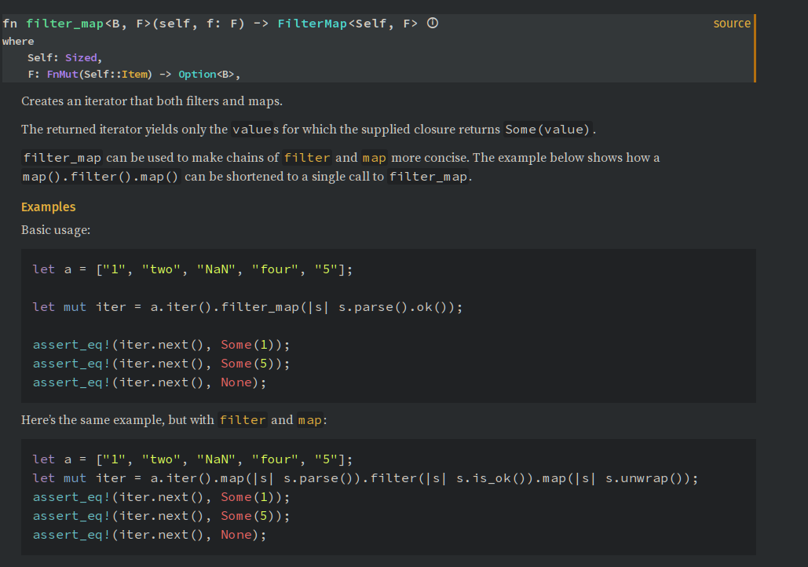

+++  
title = "Examples are not Documentation"  
date = "2024-05-02"  
tags = ["rust", "documentation"]  
keywords = ["rust", "documentation", "iced"]
description = "How to improve your documentation for Rust projects"
showFullContent = false  
draft = false  
+++
A while ago friends of mine tried writing a GUI using [iced](https://github.com/iced-rs/iced). Iced is a really cool GUI framework and [System76 is even making a desktop environment using it](https://blog.system76.com/post/locked-and-loaded-with-new-cosmic-de-updates), which I am absolutely going to try once it is ready. Inspired by the [ELM Architecture](https://guide.elm-lang.org/architecture/) it seems like the most promising GUI framework programmable (primarily) via Rust, however it's [book](https://book.iced.rs/), consisting mostly of TODOs, could use some love. (Since i started writing this post the book has started getting a few really good pages, but it still has a lot of TODOs)

As a Rustacean I have gotten adjusted to the notion of trying out the examples and reading through the source code, but while automatically compiled and run examples are great, they don't replace good documentation and often fail to explain the underlying concepts leading to frustration for novice users. Projects and Guides using the software are also nice, but sometimes use an [older version of the framework](https://github.com/iced-rs/awesome-iced). This is not a criticism of iced specifically, but more a lack I've noticed with many Rust projects. 

Examples get familiar users up to speed very quickly, but unfamiliar users are often left in the dark with magical functions, structs and maybe even macros (which new users may not know how to [expand](https://github.com/dtolnay/cargo-expand)). Fortunately, most of the time this is Rust, and in most cases Rust code is pretty easy to read, so figuring out what something does is relatively easy, but even in this case, good documentation gives users of a library more guidance about what it does.

# How can this be fixed?
Of course for many projects this is not a priority. Many crates are very much a Work-In-Progress and breaking changes are to be expected. As such most documentation would have to be rewritten and quickly outdated, although I still find outdated documentation better than none, since it can be easier to figure out what has changed. But if you do want to improve documentation there are many options that makes the life of Rust users and developers easier. Besides the `///` to [document functions, components and modules in Markdown](https://doc.rust-lang.org/rustdoc/how-to-write-documentation.html) these are things that stuck out to me.

## Links
Links are a pretty great way to provide more context, while allowing users who may know, say a [Skip List](https://en.wikipedia.org/wiki/Skip_list) to read ahead.
## Books
I think [the async book](https://github.com/rust-lang/async-book), which is still sadly unfinished, makes a good example of how to write a [mdbook](https://rust-lang.github.io/mdBook/), but still have CI for your examples, by writing your code in Rust files and including them in the mdbook like this:
``````
```rust,edition2018```
`{{#include ../../examples/06_04_spawning/src/lib.rs:example}}`
``````

## Sharing your projects
If you made a project that you think could be useful to somebody: Share it and document your findings and difficulties and quirks you encountered, so other users may learn from your mistakes.

## Examples of how to use functions
The Rust std library is among the best documented Rust projects. You commonly see examples of how to use these functions. These also show up in IDEs, which is a massive productivity booster. Bonus Points if the code examples show what assumptions about them are wrong. As for keeping them updated: [cargo test runs them by default](https://doc.rust-lang.org/cargo/commands/cargo-test.html#documentation-tests) and breaking these tests may remind you to update the now-outdated documentation as well.


## What can you do?
That's all well and good. Library authors should be aware that good documentation often saves users a lot of trouble (and maybe themselves some problems). But what can you do as a user of this library? 

If you see something you don't understand (and you've already researched it), try to figure out how it works by reading through the code, and maybe file an issue (the issue tracker will also help other users with similar problems, of course). Once you understand it, try to write documentation from the user's point of view (bonus points for examples and showing which assumptions are wrong). This can also help the maintainers immensely, as writing from a user's point of view can be very difficult. Then open a pull request, and the author will most likely accept it, as they are almost always happy to get some help. Be sure to read the contribution guidelines though, and if the maintainers want you to do it, file a bug first to see if documentation is wanted.

Apart from that, I plan to write some iced-related posts in the near future for some Linux window manager projects I have in mind. Hope to see you then!