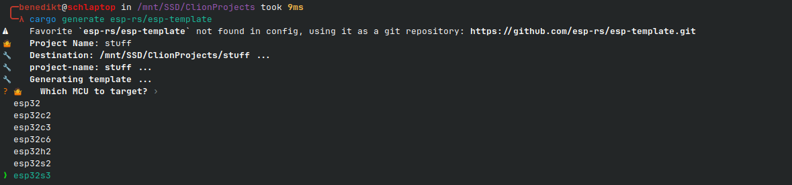
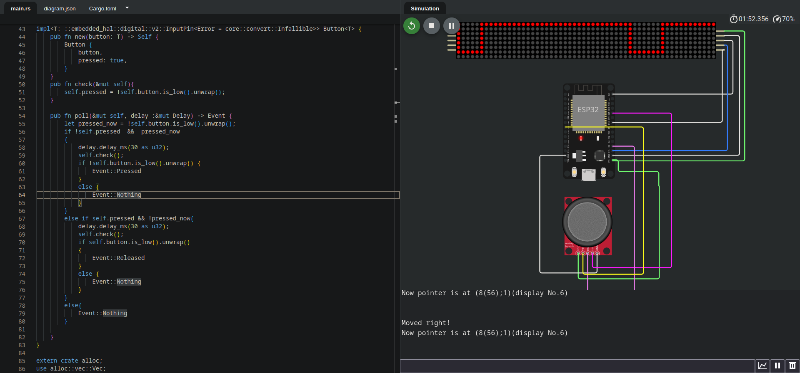
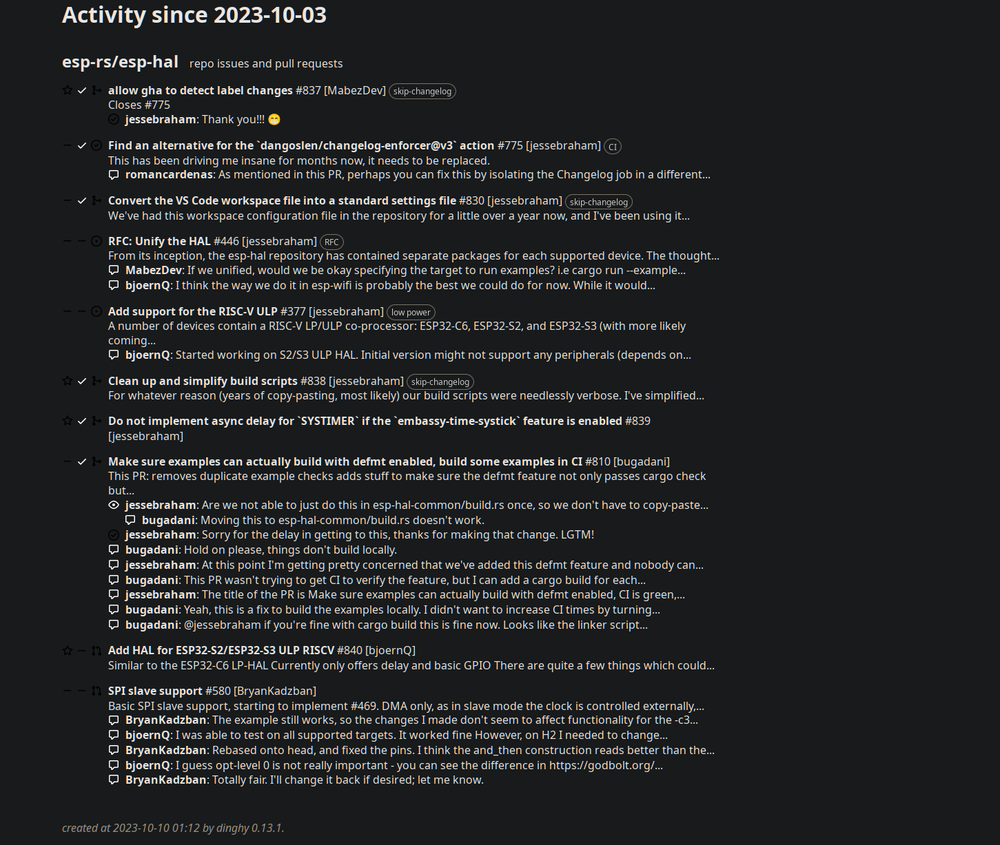

+++  
title = "A getting started guide to ESP32 no-std Rust development"  
date = "2023-10-13"  
tags = ["rust", "esp32", "microcontroller", "no-std"]  
keywords = ["rust", "esp32", "microcontroller", "no-std"]
description = "Programming ESP32 microcontrollers in Rust without the standard library"
showFullContent = false  
draft = true  
+++


So you want to program bare-metal Rust on microcontrollers? One option you could try are ESP32 microcontrollers. The experience is far from perfect, but it's getting there and there is much to learn.

This is an overview of the setup and the tools used for no-std Rust development on ESP32 microcontrollers and will be updated if anything changes so if anything goes wrong, [raise an issue](https://github.com/Nereuxofficial/duckblog/issues/new) or [contact me on Mastodon](https://infosec.exchange/@Nereuxofficial).


The ESP32-family are excellent microcontrollers for many applications with a WI-FI/BLE Chip Built-in. They come in many different form factors, with some being [smaller than your average thumb drive](https://github.com/makermoekoe/Picoclick-C3) and are [commonly used by hobbyists for a wide variety of projects](https://hackaday.io/search?term=ESP32).

And thanks to Espressif developers we have the ability to write Rust code for it. Either with Espressif's [ESP-IDF](https://github.com/espressif/esp-idf) Framework running on FreeRTOS or bare-metal, which is arguably way cooler(but also more dangerous).

## Microcontrollers
Espressif has many microcontrollers. There is the [ESP8266](https://www.espressif.com/en/products/socs/esp8266), which has a [hal,](https://github.com/esp-rs/esp8266-hal) but it is in maintenance mode, so I would recommend strongly against it. There is also no wifi-support for the HAL(Hardware-Abstraction-Layer). However, you can of course fork it and make it suitable for your project.

The ESP32 family is a bit more expensive, but offer some compelling features like faster processors or even multiple processors or [Thread/Zigbee/Matter](https://www.theverge.com/23165855/thread-smart-home-protocol-matter-apple-google-interview) support, which seems like a technology that will be highly influential in the IoT space.
Here is a list of the ones I've tried:

|                              | ESP32                       | ESP32-C3                 | ESP32-C6                                              | ESP32-H2                              | ESP32-S3                    |
|------------------------------|-----------------------------|--------------------------|-------------------------------------------------------|---------------------------------------|-----------------------------|
| CPU Architecture             | Xtensa                      | RISC-V                   | RISC-V                                                | RISC-V                                | Xtensa                      |
| Bluetooth/Wifi               | ✅                           | ✅                        | ✅                                                     | ✅                                     | ✅                           |
| Dual Core                    | ✅                           | 🚫                       | ✅                                                     | 🚫                                    | ✅                           |
| Zigbee/Thread/Matter Support | 🚫                          | 🚫                       | ✅                                                     | ✅                                     | 🚫                          |
| Notes                        | a bit older but very common | most common RISC-V model | second CPU is a low-power CPU, very recently released | low-power CPU, also recently released | has some boards with camera |


## IDE Setup
Personally I mostly use CLion with the Rust plugin(or in the future probably RustRover). This works fine for my use-case, but if you prefer a free alternative for developing Rust for the ESP32 I'd recommend VSCode(or VSCodium if you prefer the freer alternative) with [rust-analyzer](https://marketplace.visualstudio.com/items?itemName=rust-lang.rust-analyzer).

## Project Setup
If your ESP32 has a Xtensa CPU(see the [microcontrollers table](#Microcontrollers)) you need to install `espup` first, which is similar to `rustup`, but is for managing your Xtensa Rust toolchain and custom LLVM, which will not be necessary anymore once the changes are merged upstream.
To install it run:
```bash
cargo install espup
espup install
. ~/export-esp.sh
```

To create a new Rust project usually you just run `cargo new --bin my-project` and then go from there. This however proves difficult due to the dependencies changing interfaces quite often and finding compatible versions is finicky(guess who wasted hours on that). Instead, I would recommend using [esp-template](https://github.com/esp-rs/esp-template):

1. Install cargo-generate(If you don't already have it):
   `cargo install cargo-generate`
2. Generate your project from the template:
   `cargo generate esp-rs/esp-template`
3. Choose your ESP32 Model from the list, here is the current one:
   
4. Advanced template options allows you to enable heap allocations, logging and Wi-Fi/BT/ESP-Now as well as DevContainers, Wokwi and CI Files, so if you need any of those, choose `true`
5. Then choose whether to enable Wi-Fi/Bt/ESP-Now; Heap allocations allowing you to use stuff like Vectors or `String`; Dev Containers, which will set up the development environment automatically inside VSCode; Files for Continuous Integration via GitHub Actions; Wokwi Support(see [Wokwi](#Wokwi)) and logging via the `log` crate


Then to flash your project you need to install `espflash` via:
```bash
cargo install espflash
```
On Linux add your current user to the `dialout` group via(This may vary from distro to distro):
```
sudo usermod -a -G dialout $USER
```
Log out and back in, and you should be good to flash your first application directly onto microcontroller by running this in your projects' directory:
```bash
cargo run
```
If this fails during flashing, try holding the boot button on your device and run the command again.

And you flashed your first Rust code onto your ESP32. Congratulations!
## Wokwi
[Wokwi](https://wokwi.com/) is a really cool website allowing you to replay your projects(if all your hardware is implemented for Wokwi) completely in the browser. Some features may cost something in the future, but I just found it incredibly helpful in the past. It also has a plugin for VScode, essentially doing the same but right in your IDE.
 

## Updates about the ESP32 Ecosystem
If you want an overview of new features in the last few months in esp-rs you should check out [Scott Mabins Blog](https://mabez.dev/blog/posts/) for updates.

Additionally, there is an [automatic digest](https://esp-rs.github.io/repo-activity-digest/) for every repository of the [esp-rs](https://github.com/esp-rs) organization where you can check out the latest developments in the respective repository.

Here is the current repository digest for [esp-hal](https://github.com/esp-rs/esp-hal), which houses most of the no-std development I'm interested in:


# Dependencies
Finding dependencies usable in no-std environments is not easy. Many of the ones you may be used to using in std environments cannot be used here and commonly library authors don't mention it in their READMEs.
Here are a few tips on how to find them when it is not written in the Readme:
- Look for the `#![no_std]` attribute in the crate's `lib.rs` file
- Look into the GitHub Issues and search for `no_std`

Most times you will then find the feature flag to enable no_std support this way.

# References
If you are looking for references on how to do certain things(like using an [Analog Digital Converter](https://github.com/esp-rs/esp-hal/blob/main/esp32-hal/examples/adc.rs)) in this environment you will probably find that resources are really scarce. But here are some I would recommend:
- The examples directories of [esp-hal](https://github.com/esp-rs/esp-hal/tree/main/esp32-hal/examples) or [esp-wifi](https://github.com/esp-rs/esp-wifi/tree/main/examples-esp32) for your specific chip feature many simple examples of common use cases
- [ApolloLabs ESP32 Blog posts](https://apollolabsblog.hashnode.dev/series/esp32c3-embedded-rust-hal)
- [Awesome ESP Rust](https://github.com/esp-rs/awesome-esp-rust)
- If you like videos more, there is a [Rust Linz talk](https://www.youtube.com/watch?v=0PPPdqoDBQs) and [one of my sponsors is making a video series](https://youtu.be/s42yROAajzw?si=rv0Z5B6R5H1CWNUL)
- [My Blog posts about an ESP32 Wi-Fi Lamp](https://nereux.blog/tags/esp32) if you work with similar hardware

The things I personally am missing from these are probably more complex projects.
## Troubleshooting issues
`no-std` development in Rust as of now is tough. You may not get proper stacktraces and debugging support without using a debugger (even if there is one on the board). Here is my usual workflow on troubleshooting these issues:
1. Add lots of logging to help me understand what leads to the error
2. Change the code to a simpler state to try if that changes something
3. Search [GitHub Issues](https://github.com/esp-rs/esp-hal/issues?q=) of esp-hal or esp-wifi(or whatever may also be at fault)
4. Search in the [esp-rs Matrix channel](https://matrix.to/#/#esp-rs:matrix.org)
5. And if none of those resolve my issue: Just ask in the [esp-rs Matrix channel](https://matrix.to/#/#esp-rs:matrix.org). Don't be afraid, they are really nice and helpful.

This is something I struggled with a lot while getting into microcontroller programming using Rust since esp-rs was far less practical and no guides were written down, so I decided to write a comprehensive guide. I hope it helped you and provides you with some resources on how to get help. If there's anything I missed, don't hesitate to give me a heads-up!

If you have any questions or suggestions feel free to [contact me](https://nereux.blog/contact/). And if you want to support me and my work, you can do so [here](https://github.com/sponsors/Nereuxofficial).