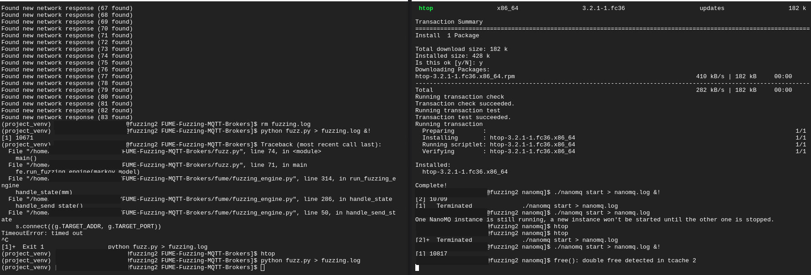
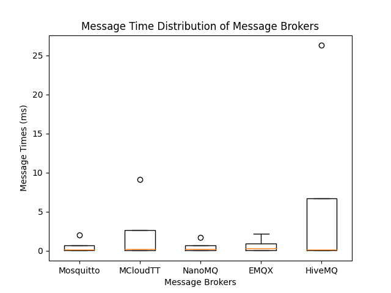

+++  
title = "How NanoMQ had a double free and what we can learn from it"  
date = "2023-04-25T14:31:55+02:00"  
author = ""  
authorTwitter = "" #do not include @  
cover = ""  
tags = ["C", "nanomq", "security", "fuzzing", "rust"]  
keywords = ["C", "nanomq", "security", "fuzzing", "long"]  
description = "Discovery of a double free in a C MQTT broker and what can be done about it"  
showFullContent = false  
draft = false  
+++  
People often ask me why I use Rust for my projects. I usually answer that I like the language and that it is a good fit  
for my use cases. But there is another reason: I came from C++, but I never really liked it. I always felt that it was  
overly complex, and it was really easy to make grave mistakes. In this post I want to show you how I found a double  
free in [NanoMQ](https://github.com/emqx/NanoMQ), an MQTT broker written in C, and what we can learn from it.

# Prerequisites
I tried to keep this post as beginner-friendly as possible. Here is a short list of what you need to know:
- Basic programming knowledge
- Basic knowledge of pointers

# Introduction to Undefined Behavior
Coming from a high-level language like Python or Java, you might not be familiar with the concept of undefined behavior.  
In C/C++ (and even in unsafe Rust!) you can write code that is not defined by the language. [This allows the compiler to  
make optimizations that would not be possible otherwise](https://blog.llvm.org/2011/05/what-every-c-programmer-should-know_14.html) and while most C/C++ programmers are aware of this, some of them don't know the full extent of what is and what is not undefined behavior. 

For example, the following code is [undefined behavior in C/C++](https://blog.regehr.org/archives/213):
```c  
#include <limits.h>  
#include <stdio.h>
int main (void) {
    printf ("%d\n", (INT_MAX+1) < 0);  
    return 0;  
}  
```  
A simple overflow. And while when you run this code on your machine, it will probably print `1`, it is not guaranteed to  
do so. However, the compiler is allowed to assume that the value is bigger than 0 and optimize the code  
accordingly(unless compiled with -fwrapv). And while this is just one example of UB in C/C++, there are many more.  
Now what happens when the compiler optimizes the code in a way that is not intended by the programmer? Well all 
garuantees the language gives you are off, so [pretty much everything](https://blog.regehr.org/archives/213).

Here are some other examples of undefined behavior in C/C++:
- Dividing by 0
- Dereferencing a null pointer
- Dereferencing a pointer to an object that has already been freed
- Memory access out of bounds
- Modifying a string literal

Now there are many tools to detect all kinds of UB(the -ftrapv flag, valgrind etc.), but they are not perfect.
And the larger your codebase gets, the harder it gets to spot this UB and even projects like the Linux kernel with really
skilled developers and many eyes looking at the code have [memory bugs in them](https://www.linuxkernelcves.com/cves).

# The MQTT Protocol
MQTT is a lightweight publish/subscribe messaging protocol, which has many applications in the IoT space. It is a binary
protocol, which means that it is not human-readable, but it is also very compact and fast. It is also a very simple
protocol, which makes it easy to implement. 

Thankfully for our broker, we didn't have to decode the packets ourselves,
but we could use a library for that. We used [mqtt-v5](https://github.com/bschwind/mqtt-broker) and contributed [some](https://github.com/bschwind/mqtt-broker/pull/49) 
[patches](https://github.com/bschwind/mqtt-broker/pull/53) to the source repository as well!

# Fuzzing the brokers
## What is fuzzing?
The term of fuzzing goes back to the 80s, when it was used to describe the process of sending random data to a program
to see if it crashes. They discovered bugs in many common Unix programs with this technique. [The paper](https://dl.acm.org/doi/pdf/10.1145/96267.96279) is quite interesting.
Nowadays, Fuzzers are quite sophisticated and can find bugs in many programs. They use instrumentation to find new paths
in the program and generate new inputs based on the data they gathered. There are many fuzzers out there, but the most
popular ones are [AFL++](https://aflplus.plus/) and [Honggfuzz](https://honggfuzz.dev/).

## Let's fuzz!
The project was very simple: Develop a simple MQTT Broker that is secure while also being fast. During the project
we used fuzzing to find bugs in our code and test the security of the broker. Initially, the plan was to use Honggfuzz, 
which worked great with our Rust code and our MQTT decoding dependency, but then we had the idea to use it to fuzz other
fuzzers as well. And while it was really easy to fuzz a function which decodes MQTT packets, passed in as raw bytes, 
which is really easy to fuzz. Here is the code for the function:
```rust
extern crate core;
use bytes::BytesMut;
use honggfuzz::fuzz;
use mqtt_v5_fork::decoder::decode_mqtt;
use mqtt_v5_fork::types::ProtocolVersion;

fn main() {
    loop {
        fuzz!(|data: &[u8]| {
            if let Ok(packet) = decode_mqtt(&mut BytesMut::from(data), ProtocolVersion::V500) {
                let _ = packet;
            }
        });
    }
}
```
Meanwhile, [NanoMQ](https://github.com/emqx/NanoMQ) relied on a lot of global state and was not really easy to fuzz and when I finally had written
a fuzzing function for it it complained that it didn't run in a multithreaded environment. There was also no guarantee
that the fuzzing cases could be reproduced, because the packets may be dropped before being decoded there.

%Coolduck says%
Why would you create a fuzzing harness for every single Broker(especially with your rusty C knowledge)? 
Couldn't you just fuzz a running MQTT broker?
%coolduck%

That's a great idea!

So I searched for MQTT fuzzers and found [FUME](https://github.com/PBearson/FUME-Fuzzing-MQTT-Brokers)(AFL-net does not 
support MQTT yet). FUME uses Markov Modeling to generate MQTT packets and then sends them to the broker using the sent 
back data and optionally terminal output to discover new paths. So it takes away the work of creating fuzzing harnesses 
for every broker and (at the cost of efficiency) allows you to fuzz any MQTT broker(and it was also used to find a 
security vulnerability in Mosquitto!).

So I started FUME and let it run with the following brokers:
- [MCloudTT](https://github.com/mcloudtt/mcloudtt)(Rust)(our broker)
- [mosquitto](https://mosquitto.org/)(C)
- [NanoMQ](https://github.com/emqx/NanoMQ)(C)
- [EMQX](https://github.com/emqx/emqx)(Erlang)
- [HiveMQ](https://www.hivemq.com/)(Java)

And after waiting a while...(and forking [FUME](https://github.com/MCloudTT/FUME-Fuzzing-MQTT-Brokers) to fix some issues)

## The Bug
We found a potential double free in NanoMQ! If you read this far take some rest. We've come a long way, and the Google 
Cloud VMs did quite a bit of work for us.

But what is a double free?

%Coolduck says%
A double free is when you free a pointer twice. This can lead to all kinds of problems, like the same memory being 
allocated twice, because essentially the memory allocator gets corrupted.
%coolduck%

But why does the terminal output say `free(): double free detected in tcache 2`?

%Coolduck says%
Well glibc has a memory allocator called `tcmalloc`(since 2.29) which is used by default on Linux. And it has a feature called tcache, which is a
per-thread cache for memory allocations. And when you free a pointer twice, it will be added to the tcache, and when you
free it again, it will detect the double free and print the error message. 
%coolduck%

Now onto the bug itself. We quickly made a PoC and tested that it wasn't a false positive.
```rust
use std::io::{Read, Write};
use std::net::TcpStream;
// For this cargo script would be nice
fn main() {
    let hex_string = b"106000044d51545405c05d552215000f62635255646d5344597577625636321600064837464f784d1700190122ea23001976744e574850653830623463567866556b6e72745659447a58000e5634566c4f73363749645451464400065a3035634f3970047ae6ec007018cde58814260c316b33456f6d53567746720003324b564036cebbd23226001839696f717650733544556f6138734f2b513656674d3136701564325474724b42497458676a3861545451596b5176";
    let decoded_buf = hex::decode(hex_string).unwrap();
    let mut conn = TcpStream::connect("127.0.0.1:1883").unwrap();
    conn.write_all(&decoded_buf).unwrap();
    conn.flush().unwrap();
    let mut read_buf = [0; 5096];
    conn.read_exact(&mut read_buf).unwrap();
    println!("Read bytes: {:?}", hex::encode(read_buf));
}
```
And tested it on some other machines, where it crashed every time(except on Windows where it just didn't crash for some 
reason).

The impact of this bug is that any attacker can crash any NanoMQ instance just by knowing their IP address and port,
making it a potential DoS vulnerability. And since NanoMQ is at least 
[aiming to be used in production](https://github.com/emqx/nanomq/discussions/640), this is a serious issue.


Now onto the bug itself. Upon debugging the crash, we found that the crash happens in the function `property_free`:
```c
int  
property_free(property *prop)  
{  
       property *head = prop;  
       property *p;  
  
       while (head) {  
              p    = head;  
              head = head->next;  
              if (p->data.is_copy) {  
                     switch (p->data.p_type) {  
                     case STR:  
                            mqtt_buf_free(&p->data.p_value.str);  
                            break;  
                     case BINARY:  
                            mqtt_buf_free(&p->data.p_value.binary);  
                            break;  
                     case STR_PAIR:  
                            mqtt_kv_free(&p->data.p_value.strpair);  
                            break;  
                     default:  
                            break;  
                     }  
              }  
              free(p);
              ^^^^ This crashes  
              p = NULL;  
       }  
       return 0;  
}
```
And upon running with valgrind we found that there are also some out of bounds reads in the lines above the free.

So we reached out to the NanoMQ developers(on Github because NanoMQ has no security contact) and they were very quick to
fix the bug. Here is the fix:
```c
if ((rv = read_uint16(&buf, packet_id)) != MQTT_SUCCESS) {  
+  *prop = NULL;  
   return rv;  
}  
  
if (length == 2 || proto_ver != MQTT_PROTOCOL_VERSION_v5) {  
+  *prop = NULL;  
   return MQTT_SUCCESS;  
}  
  
if ((rv = read_byte(&buf, reason_code)) != MQTT_SUCCESS) {  
+  *prop = NULL;   
   return rv;  
}
if (check_properties(*prop) != SUCCESS) {  
   property_free(*prop);  
+  *prop = NULL;  
   return PROTOCOL_ERROR;  
}
```
The error: Forgetting to set the pointer to NULL after freeing it. This is a common mistake in C, and it's really easy 
to make. I'd like to remind you that these people are professional developers, and they still make these mistakes. So
don't feel bad if you make them too.

# Benchmarks
So how does Rust compare to C in terms of performance? Let's do some benchmarks!
I found a great benchmarking tool called [mqtt-benchmark](https://github.com/krylovsk/mqtt-benchmark)(compiled using go 
1.17) and used it to do some benchmarks. Every broker was run with the same configuration:
- `mqtt-benchmark -clients 25 -count 1000 -size 512 -broker tcp://localhost:1883`
- Hosted on a c3-highcpu-4 instance on Google Cloud with 4 vCPUs and 8GB of RAM
This spawns 25 clients, which publish 1000 messages each and measures the time it takes for these to get published to 
it's subscriber and when the benchmark is done it outputs the results(MCloudTTs results as an example):
```
# Results for single clients, left out because it's not really relevant
========= TOTAL (25) =========
Total Ratio: 1.000 (25000/25000)
Total Runtime (sec): 1000.595
Average Runtime (sec): 1000.594
Msg time min (ms): 0.038
Msg time max (ms): 9.120
Msg time mean mean (ms): 0.429
Msg time mean std (ms): 0.034
Average Bandwidth (msg/sec): 0.999
Total Bandwidth (msg/sec): 24.985
```
And made it into a nice boxplot using python with matplotlib:
```python
import matplotlib.pyplot as plt
# Our Data
message_brokers = ["Mosquitto", "MCloudTT", "NanoMQ", "EMQX", "HiveMQ"]
msg_times = [
    [0.029, 2.002, 0.204, 0.008],[0.038, 9.120, 0.429, 0.034],[0.053, 1.703, 0.324, 0.022],[0.071, 2.133, 0.525, 0.015],[0.032, 26.286, 0.184, 0.030]
]
# For your eyes
plt.style.use("dark_background")
fig, ax = plt.subplots()
# Add these to the boxplot
ax.boxplot(msg_times)
# Label x-axis
ax.set_xticklabels(message_brokers)
# Add title and labels
ax.set_xlabel("Message Brokers")
ax.set_ylabel("Message Times (ms)")
ax.set_title("Message Time Distribution of Message Brokers", color="white")
if __name__ == "__main__":
    # Save to file
    plt.savefig("boxplot.png")
```

However, while it is not even performance oriented or optimised, it is still faster than Brokers written in 
garbage-collected Languages like Java and is not far behind the C brokers in terms of performance. I'm pretty sure with 
some optimisations it could be even faster.

You can find the full results [here](/static/broker_benchmarks.html). 
# How can this be prevented?
There are many methods to avoid this bug:
- Use an Adress Sanitizer(ASAN) to detect the double free(not reliable)
- Have an extensive Fuzzing setup(also not reliable)
- Use a safe subset of C
- Use a safe language

For me personally, the solution is to use Rust as a safe language with essentially the same speed as C, with a lot of
safety features built in and great syntax and tooling. But I'm not going to go into that here.

You might've seen that [MCloudTT](https://github.com/mcloudtt/mcloudtt) was also fuzzed and marked as our broker.
I am not here to advertise our broker, because it is not a replacement for any of the other brokers in comparison.
It only implements a subset of MQTT v5, is not MQTT v3/v4 compatible and does not support wildcards.
# Conclusion
So... Rewrite all low-level software in Rust? No, of course not.
But as [Azure's CTO Mark Russinovich wrote:](https://twitter.com/markrussinovich/status/1571995117233504257)

"*Speaking of languages, it's time to halt starting any new projects in C/C++ and use Rust for those scenarios where a 
non-GC language is required. For the sake of security and reliability. the industry should declare those languages as 
deprecated.*"

I agree with that sentiment and wouldn't start a new project in C or C++ unless I really had to. And security
critical components C/C++ software can be rewritten in Rust, because [unlike languages like Go](https://dave.cheney.net/2016/01/18/cgo-is-not-go) 
it plays nice with other languages and has a great FFI. This is also the reason Linux now allows for [Rust modules in the
kernel](https://lwn.net/Articles/908347/).

%Coolduck says%
So don't use unsafe languages in a new project. It's not worth it for a performance gain of a few percent(if any).
Bonus: You get a lot of other features like a great package manager, a great build system, a great formatter, many zero-cost abstractions 
and peace of mind that your software is safe from memory bugs.
%coolduck%

Thanks, duck! I hope you enjoyed this writeup and learned something from it. If you have any questions, feel free to 
reach out to me on [Mastodon](https://infosec.exchange/@Nereuxofficial), [Reddit](https://www.reddit.com/user/Nereuxofficial) or [Github](https://github.com/Nereuxofficial/duckblog/issues/new).